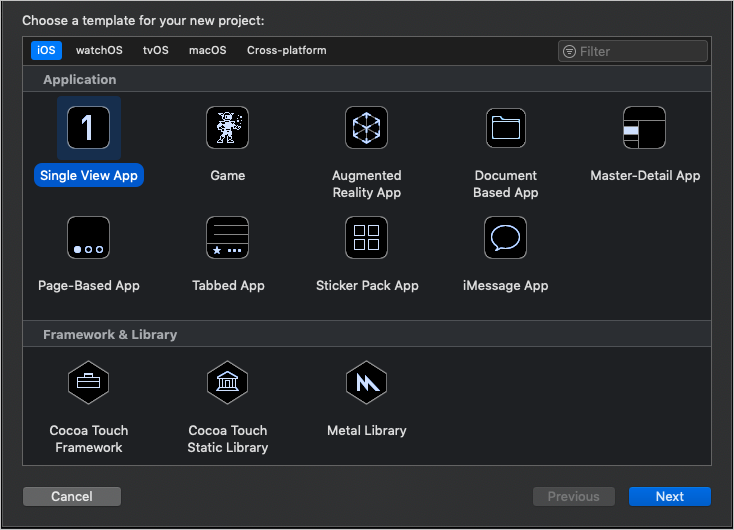
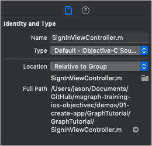
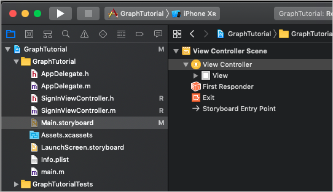
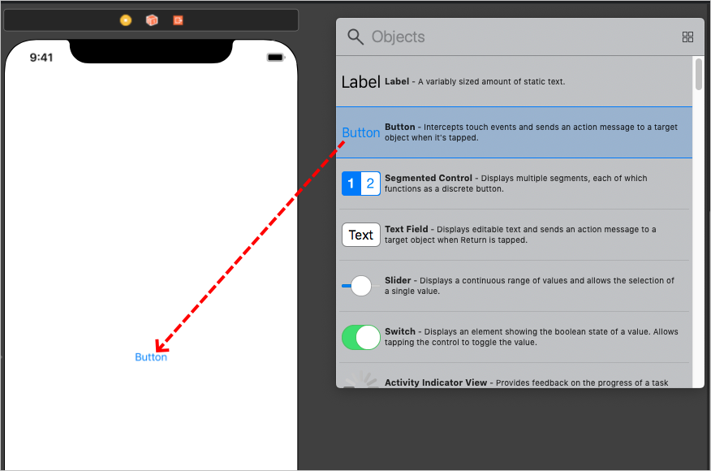
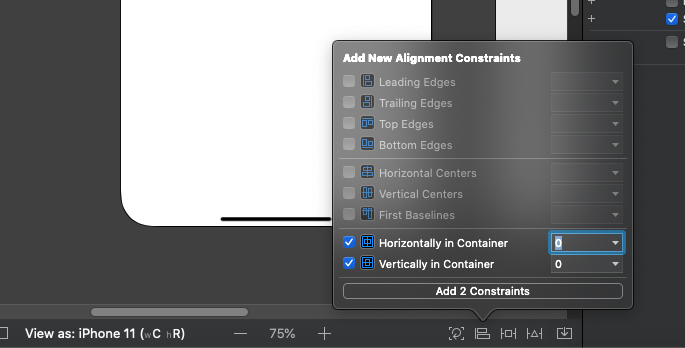
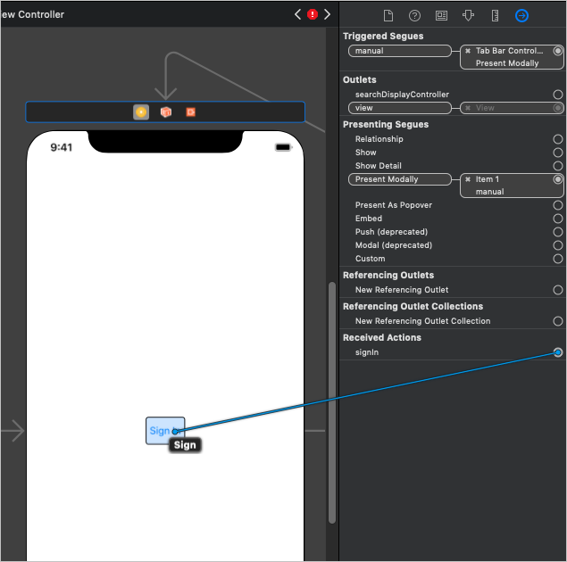
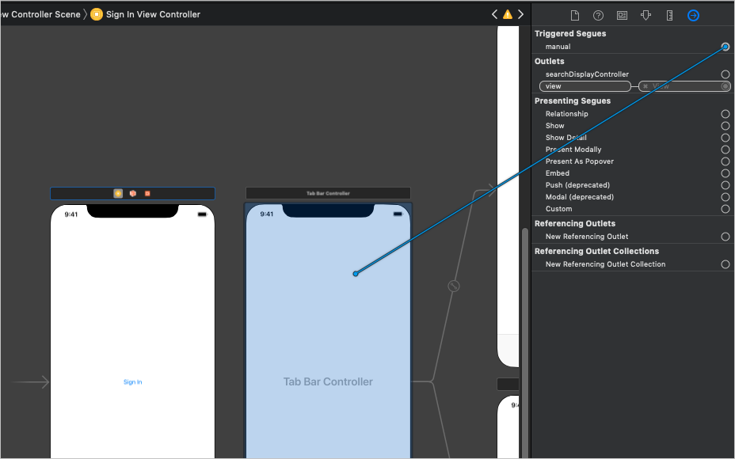
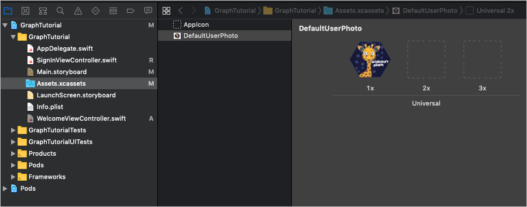
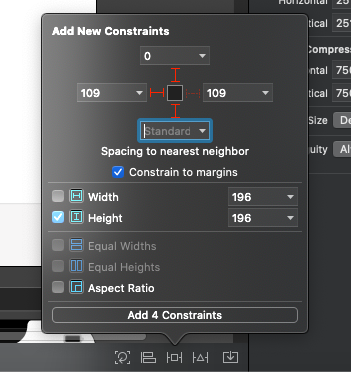

<!-- markdownlint-disable MD002 MD041 -->

Begin by creating a new Swift project.

1. Open Xcode. On the **File** menu, select **New**, then **Project**.
1. Choose the **Single View App** template and select **Next**.

    

1. Set the **Product Name** to `GraphTutorial` and the **Language** to **Objective-C**.
1. Fill in the remaining fields and select **Next**.
1. Choose a location for the project and select **Create**.

## Install dependencies

Before moving on, install some additional dependencies that you will use later.

- [Microsoft Authentication Library (MSAL) for iOS](https://github.com/AzureAD/microsoft-authentication-library-for-objc) for authenticating to with Azure AD.
- [Microsoft Graph SDK for Objective C](https://github.com/microsoftgraph/msgraph-sdk-objc) for making calls to Microsoft Graph.
- [Microsoft Graph Models SDK for Objective C](https://github.com/microsoftgraph/msgraph-sdk-objc-models) for strongly-typed objects representing Microsoft Graph resources like users or events.

1. Quit Xcode.
1. Open Terminal and change the directory to the location of your **GraphTutorial** project.
1. Run the following command to create a Podfile.

    ```Shell
    pod init
    ```

1. Open the Podfile and add the following lines just after the `use_frameworks!` line.

    ```Ruby
    pod 'MSAL', '~> 1.1.1'
    pod 'MSGraphClientSDK', ' ~> 1.0.0'
    pod 'MSGraphClientModels', '~> 1.3.0'
    ```

1. Save the Podfile, then run the following command to install the dependencies.

    ```Shell
    pod install
    ```

1. Once the command completes, open the newly created **GraphTutorial.xcworkspace** in Xcode.

## Design the app

In this section you will create the views for the app: a sign in page, a tab bar navigator, a welcome page, and a calendar page. You'll also create an activity indicator overlay.

### Create sign in page

1. Expand the **GraphTutorial** folder in Xcode, then select the **ViewController.m** file.
1. In the **File Inspector**, change the **Name** of the file to `SignInViewController.m`.

    

1. Open **SignInViewController.m** and replace its contents with the following code.

    ```objc
    #import "SignInViewController.h"

    @interface SignInViewController ()

    @end

    @implementation SignInViewController

    - (void)viewDidLoad {
        [super viewDidLoad];
        // Do any additional setup after loading the view.
    }

    - (IBAction)signIn {
        [self performSegueWithIdentifier: @"userSignedIn" sender: nil];
    }
    @end
    ```

1. Select the **ViewController.h** file.
1. In the **File Inspector**, change the **Name** of the file to `SignInViewController.h`.
1. Open **SignInViewController.h** and change all instances of `ViewController` to `SignInViewController`.

1. Open the **Main.storyboard** file.
1. Expand **View Controller Scene**, then select **View Controller**.

    

1. Select the **Identity Inspector**, then change the **Class** dropdown to **SignInViewController**.

    

1. Select the **Library**, then drag a **Button** onto the **Sign In View Controller**.

    

1. With the button selected, select the **Attributes Inspector** and change the **Title** of the button to `Sign In`.

    

1. With the button selected, select the **Align** button at the bottom of the storyboard. Select both the **Horizontally in container** and **Vertically in container** constraints, leave their values as 0, then select **Add 2 constraints**.

    

1. Select the **Sign In View Controller**, then select the **Connections Inspector**.
1. Under **Received Actions**, drag the unfilled circle next to **signIn** onto the button. Select **Touch Up Inside** on the pop-up menu.

    

### Create tab bar

1. Select the **Library**, then drag a **Tab Bar Controller** onto the storyboard.
1. Select the **Sign In View Controller**, then select the **Connections Inspector**.
1. Under **Triggered Segues**, drag the unfilled circle next to **manual** onto the **Tab Bar Controller** on the storyboard. Select **Present Modally** in the pop-up menu.

    

1. Select the segue you just added, then select the **Attributes Inspector**. Set the **Identifier** field to `userSignedIn`, and set **Presentation** to **Full Screen**.

    

1. Select the **Item 1 Scene**, then select the **Connections Inspector**.
1. Under **Triggered Segues**, drag the unfilled circle next to **manual** onto the **Sign In View Controller** on the storyboard. Select **Present Modally** in the pop-up menu.
1. Select the segue you just added, then select the **Attributes Inspector**. Set the **Identifier** field to `userSignedOut`, and set **Presentation** to **Full Screen**.

### Create welcome page

1. Select the **Assets.xcassets** file.
1. On the **Editor** menu, select **Add Assets**, then **New Image Set**.
1. Select the new **Image** asset and use the **Attribute Inspector** to set its **Name** to `DefaultUserPhoto`.
1. Add any image you like to serve as a default user profile photo.

    

1. Create a new **Cocoa Touch Class** file in the **GraphTutorial** folder named `WelcomeViewController`. Choose **UIViewController** in the **Subclass of** field.
1. Open **WelcomeViewController.h** and add the following code inside the `@interface` declaration.

    ```objc
    @property (nonatomic) IBOutlet UIImageView *userProfilePhoto;
    @property (nonatomic) IBOutlet UILabel *userDisplayName;
    @property (nonatomic) IBOutlet UILabel *userEmail;
    ```

1. Open **WelcomeViewController.m** and replace its contents with the following code.

    ```objc
    #import "WelcomeViewController.h"

    @interface WelcomeViewController ()

    @end

    @implementation WelcomeViewController

    - (void)viewDidLoad {
        [super viewDidLoad];
        // Do any additional setup after loading the view.

        // TEMPORARY
        self.userProfilePhoto.image = [UIImage imageNamed:@"DefaultUserPhoto"];
        self.userDisplayName.text = @"Default User";
        [self.userDisplayName sizeToFit];
        self.userEmail.text = @"default@contoso.com";
        [self.userEmail sizeToFit];
    }

    - (IBAction)signOut {
        [self performSegueWithIdentifier: @"userSignedOut" sender: nil];
    }

    @end
    ```

1. Open **Main.storyboard**. Select the **Item 1 Scene**, then select the **Identity Inspector**. Change the **Class** value to **WelcomeViewController**.
1. Using the **Library**, add the following items to the **Item 1 Scene**.

    - One **Image View**
    - Two **Labels**
    - One **Button**

1. Using the **Connections Inspector**, make the following connections.

    - Link the **userDisplayName** outlet to the first label.
    - Link the **userEmail** outlet to the second label.
    - Link the **userProfilePhoto** outlet to the image view.
    - Link the **signOut** received action to the button's **Touch Up Inside**.

1. Select the image view, then select the **Size Inspector**.
1. Set the **Width** and **Height** to 196.
1. Use the **Align** button to add the **Horizontally in container** constraint with a value of 0.
1. Use the **Add New Constraints** button (next to the **Align** button) to add the following constraints:

    - Align Top to: Safe Area, value: 0
    - Bottom Space to: User Display Name, value: Standard
    - Height, value: 196
    - Width, value: 196

    

1. Select the first label, then use the **Align** button to add the **Horizontally in container** constraint with a value of 0.
1. Use the **Add New Constraints** button to add the following constraints:

    - Top Space to: User Profile Photo, value: Standard
    - Bottom Space to: User Email, value: Standard

1. Select the second label, then select the **Attributes Inspector**.
1. Change the **Color** to **Dark Gray Color**, and change the **Font** to **System 12.0**.
1. Use the **Align** button to add the **Horizontally in container** constraint with a value of 0.
1. Use the **Add New Constraints** button to add the following constraints:

    - Top Space to: User Display Name, value: Standard
    - Bottom Space to: Sign Out, value: 14

1. Select the button, then select the **Attributes Inspector**.
1. Change the **Title** to `Sign Out`.
1. Use the **Align** button to add the **Horizontally in container** constraint with a value of 0.
1. Use the **Add New Constraints** button to add the following constraints:

    - Top Space to: User Email, value: 14

1. Select the tab bar item at the bottom of the scene, then select the **Attributes Inspector**. Change the **Title** to `Me`.
1. On the **Editor** menu, select **Resolve Auto Layout Issues**, then select **Add Missing Constraints** underneath **All Views in Welcome View Controller**.

The welcome scene should look similar to this once you're done.


### Create calendar page

1. Create a new **Cocoa Touch Class** file in the **GraphTutorial** folder named `CalendarViewController`. Choose **UIViewController** in the **Subclass of** field.
1. Open **CalendarViewController.h** and add the following code inside the `@interface` declaration.

    ```objc
    @property (nonatomic) IBOutlet UITextView *calendarJSON;
    ```

1. Open **CalendarViewController.m** and replace its contents with the following code.

    ```objc
    #import "CalendarViewController.h"

    @interface CalendarViewController ()

    @end

    @implementation CalendarViewController

    - (void)viewDidLoad {
        [super viewDidLoad];
        // Do any additional setup after loading the view.

        // TEMPORARY
        self.calendarJSON.text = @"Calendar";
        [self.calendarJSON sizeToFit];
    }

    @end
    ```

1. Open **Main.storyboard**. Select the **Item 2 Scene**, then select the **Identity Inspector**. Change the **Class** value to **CalendarViewController**.
1. Using the **Library**, add a **Text View** to the **Item 2 Scene**.
1. Select the text view you just added. On the **Editor**, choose **Embed In**, then **Scroll View**.
1. Using the **Connections Inspector**, connect the **calendarJSON** outlet to the text view.
1. Select the tab bar item at the bottom of the scene, then select the **Attributes Inspector**. Change the **Title** to `Calendar`.
1. On the **Editor** menu, select **Resolve Auto Layout Issues**, then select **Add Missing Constraints** underneath **All Views in Welcome View Controller**.

The calendar scene should look similar to this once you're done.


### Create activity indicator

1. Create a new **Cocoa Touch Class** file in the **GraphTutorial** folder named `SpinnerViewController`. Choose **UIViewController** in the **Subclass of** field.
1. Open **SpinnerViewController.h** and add the following code inside the `@interface` declaration.

    ```objc
    - (void) startWithContainer:(UIViewController*) container;
    - (void) stop;
    ```

1. Open **SpinnerViewController.m** and replace its contents with the following code.

    :::code language="objc" source="../demo/GraphTutorial/GraphTutorial/SpinnerViewController.m" id="SpinnerViewSnippet":::

## Test the app

Save your changes and launch the app. You should be able to move between the screens using the **Sign In** and **Sign Out** buttons and the tab bar.


